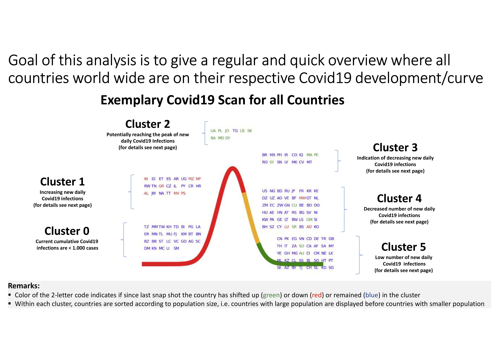
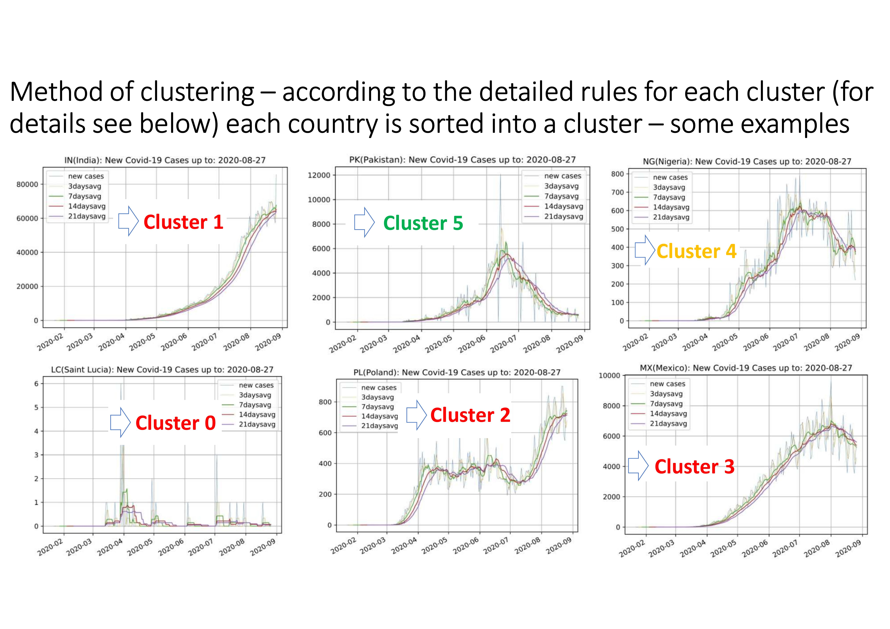
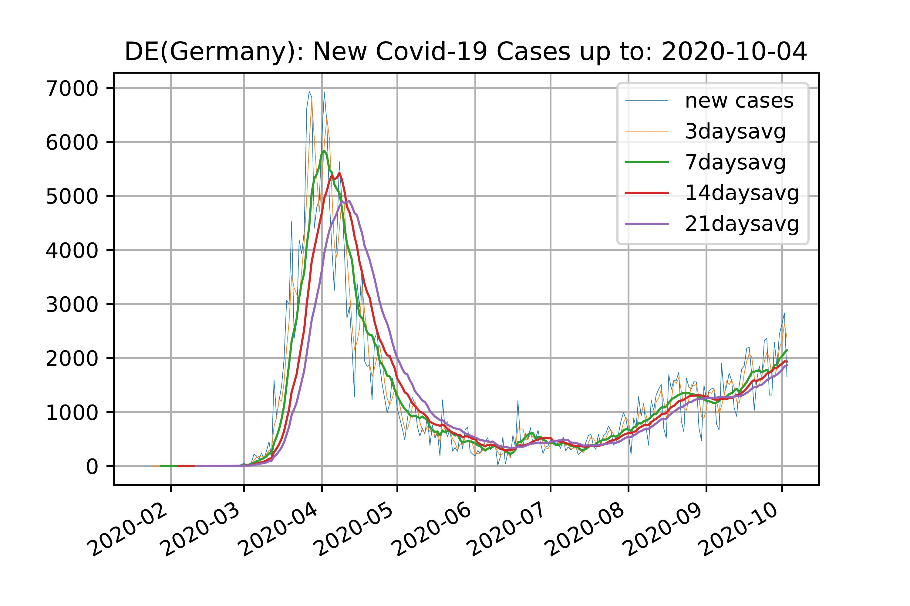
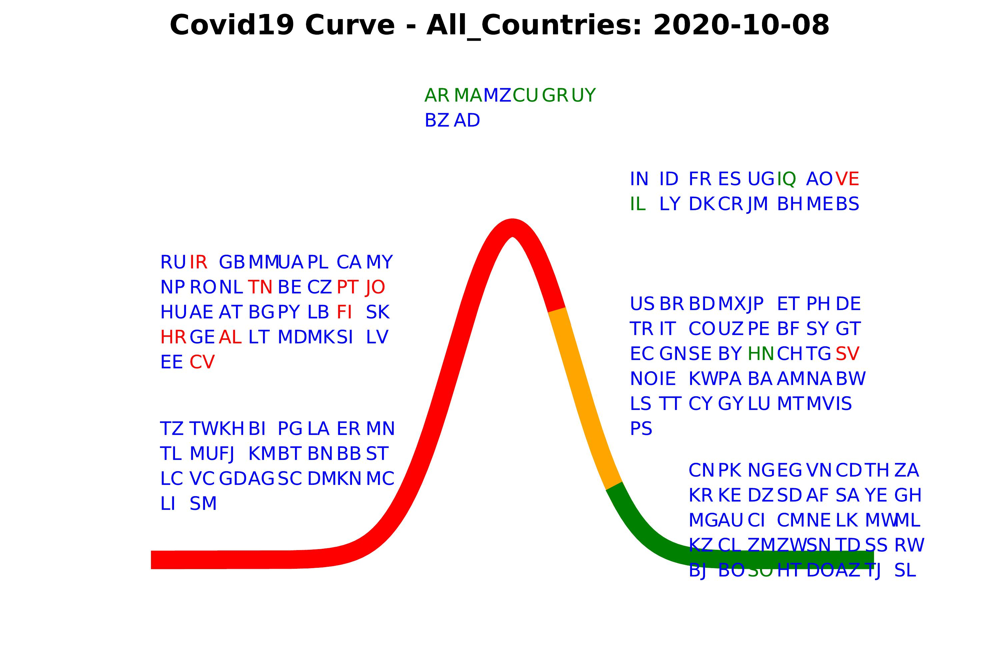

empirical_eyes

# Publishing a data science project

## I – ANALYZING THE COVID 19 INFECTION DEVELOPMENT

### 1 - Starting point - to have a (data science) question. 

In my case - at the beginning of the covid crisis - I was very much interested in having an overview on the status of covid19 infections in the various countries at each point in time. Working in the airline industry I was particularly interested in so-called online countries, i.e. countries which had formerly, i.e. before the covid19 breakout, been online connected by the airline under consideration. Idea was to early identify those countries which had covid19 "under control", because these would be the first countries, where airline travel demand would pick up again. 

My goal was not to rely on any third-party reports which I could not modify or update according to my interests and needs (e.g. which countries are displayed, which figures are shown, which time comparison is displayed etc.) but to build up an analysis/report which reflected my approach of describing the current covid situation. The basic idea was to somehow scan the typical (i.e. "bell shaped") covid curve of new infections for each and every country and then to position each country on such a "typical generic bell shaped covid curve" in order to get an overview on one page. 

The basic idea is sketched on following two slides: 



### 2 - Data science software

Apart from the (data science) question you obviously have to have access to a data science software that provides the required functionalities you need in order to collect, modify/manipulate and finally analyse and display the data and results.

Having worked in data science over many years I have gained some experience in data science, econometrics and statistics related software such as GAUSS, SAS, SPSS, LIMDEP, R, etc. as well as data handling related/programing languages, e.g. SQL, PHP, Perl, etc.. Python however I had not touched so far and hence looking into some statistics on data science software usage showed me that the usage of Python was substantially increasing over the last years. Hence, I wanted to get an understanding of Python and decided to use Python for this project.

How to install Python in which version and with which modules? There are various tutorials and videos in the internet available which provide a very good description on how to install Python. My first approach was to install python directly from the [python page](https://www.python.org/downloads/windows/) which worked out very smooth. However later on, when I was interested in having an environment which also contains additional to Python respective programming editors and IDEs as well as potential interfaces to other data science software such as R, etc.. For that purpose the distribution manager [Anaconda](https://en.wikipedia.org/wiki/Anaconda_(Python_distribution)) is suited very well. As package manager I used [pip](https://de.wikipedia.org/wiki/Pip_(Python)), but there is also as alternative [conda](https://en.wikipedia.org/wiki/Conda_(package_manager)) - for differences between both package managers see e.g. following [Link](https://www.anaconda.com/blog/understanding-conda-and-pip). 

After having installed Anaconda you have a set of programming editors and IDEs (e.g. Jupyter Notebook, JupytherLab, Spyder, PyCharm, etc.) at hand. For a nice overview and comparison of such Python IDEs and code editors see under following [Link](https://www.datacamp.com/community/tutorials/top-python-ides-for-2019). I have started of with JupytherLab and later additionally also used Spyder.

### 3 - Data analysis

In the following I will describe the various steps of the data analysis which have been conducted including the corresponding python script. If you would like to see the full final python scripts please look here:

- [Data_Preparation_(01__run_covid_sv_1.py)](01_run_covid_sv_1.py)
- [Web_Application_(02_web_covid_sv_1.py)](02_web_covid_sv_1.py)

#### 3a - Data Preparation

The first script is focussing on preprocessing the data and doing the necessary calculations for the analysis. After this has been done the preprocessed data is than being stored in some Excel files. The second script reads/opens this preprocessed data and than focuses in particular on displaying the results to the enduser. 

I will start of with explaining the first script. Every data analysis starts of with finding/getting an appropriate data source to be analyzed. In my case basically in a first step a Google search directed me to the GitHub Data Source: D2019 Novel Coronavirus COVID-19 (2019-nCoV) Data Repository by Johns Hopkins CSSE. 

In order to extract this data from the John Hopkins University GitHub Data Repository and to further work with it in Python it is very useful to install the package pandas, which is a very powerful Python data analysis library. Additionally to pandas there are further packages such as numpy, DateTime, matplotlib etc. within Python which will be very helpuful for the further analysis.  

The installation of such packages (e.g. pandas, numpy, etc.) is done very easily via the package manager pip using the following commands: 

```
- pip install pandas
- pip install numpy
- pip install Datetime
- ...
``` 
Once such different Python packages (e.g. pandas, numpy, etc.) have beeen installed, you can easily import them right at the beginning of your programm. Moreover I'm defining some local paths which will be used later on within the program.
```
# (0) Import various packages 
import pandas as pd
import numpy as np
import datetime
from datetime import date, datetime, timedelta
import requests
import matplotlib.pyplot as plt
from matplotlib.backends.backend_pdf import PdfPages
import matplotlib.dates as mdates
from pandas.plotting import register_matplotlib_converters
register_matplotlib_converters()
import sqlite3
import pandasql
from pandasql import sqldf

# Define local or remote paths for later
locpath0 = "/home/ubuntu/00_stammdaten/"
locpath1 = "/home/ubuntu/01_covid_scan/01_data/"
```
After the packages have been imported you are ready to start processing the data. Following command will extract you the respective COVID19 data (in my case only the confirmed Covid19 cases) into a pandas dataframe:
```
# (1) get covid data from JHU and cleanse some Country Names
url = 'https://raw.githubusercontent.com/CSSEGISandData/COVID-19/master/csse_covid_19_data/csse_covid_19_time_series/time_series_covid19_confirmed_global.csv'
confirmed = pd.read_csv(url, error_bad_lines=False)
print(confirmed)
```
Given that the data is provided in some cases on country and in other cases on state level and I only intend to do the analysis on country level an aggregation of the infection figures to the country level need to be done:
```
# (2) aggregate to country
confirmed_cn = confirmed.groupby('Country/Region', as_index=False).agg({np.sum})
confirmed_cn.columns = confirmed_cn.columns.droplevel(1)
confirmed_cn = confirmed_cn.reset_index()
confirmed_cn = confirmed_cn.drop(columns=['Lat', 'Long'])
```
After this various caluculations are being conducted. For example based on the available cumulative infections the value of daily new infections needs to be derived. Addionally  for the purpose of getting a better view on the development of new infections it make sense to calculate moving averages for different time periods (e.g. 7 days, 14 days, etc.). Also this section aims to calculate for each country the cluster affiliation on the typical bell shaped curve of new infections. Looking at such a curve I somehow started of with *visually* defining 6 clusters as follows:

- Cluster 0: Current cumulative Covid19 infections are still very low
- Cluster 1: Increasing new daily Covid19 infections
- Cluster 2: Potentialy reaching the peak of new daily Covid19 infections
- Cluster 3: Indication of decreasing new daily Covid19 infections
- Cluster 4: Decreased number of new daily Covid19 infections (compared to historical peak)
- Cluster 5: Low number of new daily Covid19 infections (compared to historical peak)

Obviously one needs to translate these visual cluster definition into some *operational* rules which can be applied to any data set of historical and current numbers of new covid infections for each country at hand. The *operational* rules I have used are as follows:

- Cluster 0: Current cumulative Covid19 infections are still very low
  - Current cumulative Covid19 infections are < 1.000 cases
- Cluster 1: Increasing new daily Covid19 infections
  - Avg 7 days level > 70% of max avg 7 days level so far
  - Avg 7 days level > Avg 14 days level
  - Avg 7 days level increases
- Cluster 2: Potentialy reaching the peak of new daily Covid19 infections
  - Avg 7 days level > 70% of max avg 7 days level so far
  - Avg 7 days level > Avg 14 days level
  - Avg 7 days level decreases
- Cluster 3: Indication of decreasing new daily Covid19 infections
  - Avg 7 days level > 70% of max avg 7 days level so far
  - Avg 7 days level < Avg 14 days level
- Cluster 4: Decreased number of new daily Covid19 infections (compared to historical peak)
  - Avg 7 days level between 30% and 70% of max avg 7 days level so far
- Cluster 5: Low number of new daily Covid19 infections (compared to historical peak)
  - Avg 7 days level < 30% max avg 7 days level so far

If you look at the coding below you will see that there are various steps in between necessary in order to get to these final cluster affiliations. Moreover apart from calculating the current cluster affiliation my goal is also to later on display the development/dynamic of cluster affiliation, i.e. to show if a country has remained within the cluster or shifted one cluster up or down since the last snap shot. 
 
```
# (3) Do various calculations (e.g. transpose data, calculate new infections and moving averages, etc. )
# transpose datum from attribute name to columne
confirmed_cntp = confirmed_cn.melt(id_vars=["Country/Region"])
confirmed_cntp = confirmed_cntp.rename(columns={"variable": "datum", "value": "confi"})
confirmed_cntp["datum"] = confirmed_cntp["datum"].astype('datetime64[ns]')
confirmed_cntp = confirmed_cntp.sort_values(by=["Country/Region", "datum"])
confirmed_cntp = confirmed_cntp.reset_index()
confirmed_cntp = confirmed_cntp.drop(columns=['index'])

#calculate new infections: new, newpct, newgr, newgrlg
confirmed_cntp['confi_new'] = confirmed_cntp.groupby(['Country/Region'])['confi'].diff()#.fillna(0)
confirmed_cntp['confi_new'] = confirmed_cntp['confi_new'].fillna(confirmed_cntp['confi'])
confirmed_cntp['confi_err'] = np.where(confirmed_cntp['confi_new'] < 0, 1, 0)
confirmed_cntp.loc[confirmed_cntp.confi_err == 1, 'confi_new'] = 0

#calculate 
  # moving average of nf for (a) 3 days (b) 7 days (c) day 8 to 14
  # moving average of nf gr for (a) 3 days (b) 7 days (c) day 8 to 14

confirmed_cntp['ma3d'] = confirmed_cntp.groupby(['Country/Region'])['confi_new'].rolling(3).mean().reset_index(0,drop=True)
confirmed_cntp['ma7d'] = confirmed_cntp.groupby(['Country/Region'])['confi_new'].rolling(7).mean().reset_index(0,drop=True)
confirmed_cntp['ma7dp1'] = confirmed_cntp.ma7d.shift(1)
confirmed_cntp['ma7dp7'] = confirmed_cntp.ma7d.shift(7)
confirmed_cntp['ma14d'] = confirmed_cntp.groupby(['Country/Region'])['confi_new'].rolling(14).mean().reset_index(0,drop=True)
confirmed_cntp['ma21d'] = confirmed_cntp.groupby(['Country/Region'])['confi_new'].rolling(21).mean().reset_index(0,drop=True)

confirmed_cntp['ma7dmax'] = confirmed_cntp.groupby('Country/Region')['ma7d'].transform('max')
confirmed_cntp['ma14dmax'] = confirmed_cntp.groupby('Country/Region')['ma14d'].transform('max')
confirmed_cntp['ma7dmaxc'] = confirmed_cntp.groupby('Country/Region').ma7d.cummax()
confirmed_cntp['ma14dmaxc'] = confirmed_cntp.groupby('Country/Region').ma14d.cummax()

confirmed_cntp['ma7dlvlc'] = confirmed_cntp['ma7d'] / confirmed_cntp['ma7dmaxc']
confirmed_cntp.loc[confirmed_cntp['ma7dlvlc'] >= 0.7, 'levelcma7d'] = 'high'
confirmed_cntp.loc[(confirmed_cntp['ma7dlvlc'] > 0.3) & (confirmed_cntp['ma7dlvlc'] < 0.7), 'levelcma7d'] = 'mid'
confirmed_cntp.loc[(confirmed_cntp['ma7dlvlc'] <= 0.3) & (confirmed_cntp['ma7dlvlc'] >= 0.1), 'levelcma7d'] = 'low_a'
confirmed_cntp.loc[confirmed_cntp['ma7dlvlc'] < 0.1, 'levelcma7d'] = 'low_b'

confirmed_cntp['ma7dmma7dp1'] = confirmed_cntp['ma7d']-confirmed_cntp['ma7dp1']
confirmed_cntp.loc[confirmed_cntp['ma7dmma7dp1'] > 0, 'kippt'] = 'no'
confirmed_cntp.loc[confirmed_cntp['ma7dmma7dp1'] <= 0, 'kippt'] = 'yes'

confirmed_cntp['ma7dmma14d'] = confirmed_cntp['ma7d']-confirmed_cntp['ma14d']
confirmed_cntp.loc[confirmed_cntp['ma7dmma14d'] > 0, 'goldencross'] = 'no'
confirmed_cntp.loc[confirmed_cntp['ma7dmma14d'] <= 0, 'goldencross'] = 'yes'

confirmed_cntp.loc[(confirmed_cntp['levelcma7d'] == 'high') & (confirmed_cntp['kippt'] == 'no') & (confirmed_cntp['goldencross'] == 'no'), 'cluster'] = 'q1'
confirmed_cntp.loc[(confirmed_cntp['levelcma7d'] == 'high') & (confirmed_cntp['kippt'] == 'yes') & (confirmed_cntp['goldencross'] == 'no'), 'cluster'] = 'q2'
confirmed_cntp.loc[(confirmed_cntp['levelcma7d'] == 'high') & (confirmed_cntp['goldencross'] == 'yes'), 'cluster'] = 'q3'
confirmed_cntp.loc[(confirmed_cntp['levelcma7d'] == 'mid'), 'cluster'] = 'q4'
confirmed_cntp.loc[(confirmed_cntp['levelcma7d'] == 'low_a'), 'cluster'] = 'q5'
confirmed_cntp.loc[(confirmed_cntp['levelcma7d'] == 'low_b'), 'cluster'] = 'q5'

confirmed_cntp.loc[(confirmed_cntp['confi'] < 1000), 'cluster'] = 'q0'
confirmed_cntp.loc[(confirmed_cntp['confi'] >= 1000), 'cluster'] = confirmed_cntp.cluster

confirmed_cntp['clusterp1'] = confirmed_cntp.cluster.shift(1) 
confirmed_cntp.loc[(confirmed_cntp['cluster'] > confirmed_cntp['clusterp1']), 'clusterdev'] = 1
confirmed_cntp.loc[(confirmed_cntp['cluster'] == confirmed_cntp['clusterp1']), 'clusterdev'] = 0
confirmed_cntp.loc[(confirmed_cntp['cluster'] < confirmed_cntp['clusterp1']), 'clusterdev'] = -1

confirmed_cntp['clusterp7'] = confirmed_cntp.cluster.shift(7) 
```

In a next step I am joining/merging to the data frame above (which contains e.g. the calucation of cluster for each country) a futher data set which contains for each country some additional core information such as population or two letter country abreviations. This core data set has been pre-processed and stored as an Excel file (confirmed_ctrystamm.xlsx). Here in this program this Excel file is just being imported into a pandas data frame for further processing.

```
# (4) Merge Calculatin data set with Stammdaten and calculate further attributes

confirmed_cntrystamm = pd.read_excel(locpath0+"confirmed_ctrystamm.xlsx", keep_default_na=False,error_bad_lines=False)
confirmed_cntpfull = pd.merge(left=confirmed_cntp, right=confirmed_cntrystamm, how='left', left_on='Country/Region', right_on='Cntry_NM')

confirmed_cntpfull['incident'] = confirmed_cntpfull['confi_new']/confirmed_cntpfull['population']*100000
confirmed_cntpfull['incident7d'] = confirmed_cntpfull['ma7d']/confirmed_cntpfull['population']*100000
confirmed_cntpfull['incident7dp7'] = confirmed_cntpfull.incident7d.shift(7)

confirmed_cntpfull['confi_estshpop'] = confirmed_cntpfull['confi']*10/confirmed_cntpfull['population']
confirmed_cntpfull['daysdouble'] = confirmed_cntpfull.confi.shift(7)/confirmed_cntpfull.ma7d
```

When I was confronted with the situation that I needed some further information such as population and country abreviation for each country I somehow thought at the beginning that I would need to manually collect the data for the ~200 countries from the internet and put it into an Excel sheet. But luckily also here Python offers and API to query a SPARQL endpoint. Following code extracts the relevant information and stores it into an Excel file.

```
# Excurse - Get core data for each country from Wikidata via SPARQL 
import pandas as pd
import numpy as np
import requests

url = 'https://query.wikidata.org/sparql'
query = """
    SELECT ?country ?Cntry_CD ?countryLabel ?population 
      WHERE 
      {
       ?country wdt:P463 wd:Q1065.
       ?country wdt:P297 ?Cntry_CD.
       ?country wdt:P1082 ?population.
       SERVICE wikibase:label { bd:serviceParam wikibase:language "en". }
      }
"""
r = requests.get(url, params = {'format': 'json', 'query': query})
data = r.json()

from collections import OrderedDict

countries = []
for item in data['results']['bindings']:
    countries.append(OrderedDict({
        'country': item['countryLabel']['value'],
        'Cntry_CD': item['Cntry_CD']['value'],
        'population': item['population']['value'],
    }))

population = pd.DataFrame(countries)
population = population.astype({'population': float})
population = population.rename(columns={'country': 'Cntry_NMPOP'})
# Eliminierung von potentiellen Doppeleinträgen 
population.groupby(['Cntry_NMPOP', 'Cntry_CD'], sort=False)['population'].max()
population.sort_values(by='population', ascending=False)
population.reset_index(drop=True)
print(population)

population.to_excel("Population_input.xlsx", sheet_name='Tabelle1') 
```

For the purpose of futher analyzing and displaying the data and results I'm creating two separate data sets. One data set contains the full history of Covid19 infections and can be used e.g. to display for one specific country the development over time. The second data set is a subset of the first data set and only focuses on the latest snap shot figures and here the aim is to use this information for an overview and comparison of many/all countries regarding the current Covid19 situation. The two data sets are being   stored as Excel files.

```
# (5) Export two analysis data sets (a) full history time series (b) only current day figures
confirmed_cntpsel = confirmed_cntpfull.loc[:,[ 'Region_CD', 'Region_NM', 'Country/Region', 'Cntry_CD', 'confi', 'confi_new',                                              
                                               'cluster', 'clusterp7', 'levelcma7d', 'ma7dlvlc',  'clusterdev', 'kippt', 'ma7dmma7dp1', 'goldencross', 'ma7dmma14d',
                                               'ma3d', 'ma7d', 'ma14d', 'ma21d', 'ma7dp7',
                                               'daysdouble', 'incident', 'incident7d', 'incident7dp7', 'confi_estshpop', 'population', 'Rank_Pop', 'datum']]            

confirmed_cntpsel1 = confirmed_cntpfull.loc[:,[ 'Country/Region', 'Cntry_CD', 'Rank_Pop', 'datum', 'confi_new', 'ma3d', 'ma7d', 'ma14d', 'ma21d']]            
confirmed_cntpsel1.to_excel(locpath1+"covid_ana_tsa1.xlsx", sheet_name='Tabelle1')


confirmed_cntpsel = confirmed_cntpsel.sort_values(['Rank_Pop', 'datum'], ascending=[True, False])
confirmed_cntpsel = confirmed_cntpsel.reset_index()
confirmed_cntpsel = confirmed_cntpsel.drop(columns=['index'])

yd = pd.to_datetime('today').floor('d') - timedelta(days=1)
confirmed_cntpselday = confirmed_cntpsel[(confirmed_cntpsel['datum']==yd)] 
confirmed_cntpselday = confirmed_cntpselday.sort_values(['datum','Rank_Pop'], ascending=[False, True])
confirmed_cntpselday = confirmed_cntpselday.reset_index()
confirmed_cntpselday = confirmed_cntpselday.drop(columns=['index'])

confirmed_cntpselday1 = confirmed_cntpselday.loc[:,[ 'Region_CD', 'Region_NM', 'Country/Region', 'Cntry_CD', 'Rank_Pop', 'population', 'datum', 'ma7d', 'ma7dp7', 'cluster', 
                                                     'clusterp7', 'clusterdev']]            
confirmed_cntpselday1.to_excel(locpath1+"covid_ana_day1.xlsx", sheet_name='Tabelle1')
```

In a next step I'm creating plots on the (moving average) development of new Covid19 infections for each country and storing them into pdf files which have a name that allows to identify the country (based on the two letter code of the country) to which the pdf files belongs. In order to do this step repeatingly (i.e. for every country) I use/define a Python function which is then call several times (corresponding to the amount of countries).

```
# (6) Plotting the moving average of new Covid19 infections for each country into a pdf
confirmed_cntpsel1 = confirmed_cntpsel1.sort_values(['Rank_Pop', 'datum'], ascending=[True, True])

def movavganalysis(cntrysel,cntrynam):
    cnsel = confirmed_cntpsel1['Cntry_CD'] == cntrysel
    dat_ts = confirmed_cntpsel1[cnsel]
    dat_ts = dat_ts.set_index('datum')
    dir = locpath1+"trend_"+cntrysel+".pdf"
    with PdfPages(dir) as pdf:
        fig, ax = plt.subplots()
        l1, = ax.plot(dat_ts.index, dat_ts.confi_new, linewidth=0.3, label='new cases')
        l2, = ax.plot(dat_ts.index, dat_ts.ma3d, linewidth=0.3, label='3daysavg')
        l3, = ax.plot(dat_ts.index, dat_ts.ma7d, linewidth=1, label='7daysavg')
        l4, = ax.plot(dat_ts.index, dat_ts.ma14d, linewidth=1, label='14daysavg')
        l5, = ax.plot(dat_ts.index, dat_ts.ma21d, linewidth=1, label='21daysavg')
        plt.legend(handles=[l1, l2, l3, l4, l5])
        fig.autofmt_xdate()
        ax.fmt_xdata = mdates.DateFormatter('%Y-%m-%d')
        #format the ticks
        plt.grid(True)
        plt.axis('tight')
        #plt.show()
        plt.title(cntrysel + '(' + cntrynam + ')' + ': New Covid-19 Cases up to: ' + datetime.today().strftime('%Y-%m-%d'))
        #plt.ylabel('Cases')
        pdf.savefig()
        plt.close()
      
rows, cols = confirmed_cntpselday.shape
for i in range(rows):
    movavganalysis(confirmed_cntpselday.iloc[i,3],confirmed_cntpselday.iloc[i,2])
```

As a short excurse, below there is a short code example on how to convert the pdf files (for each and every country) from above into e.g. jpg files. At the beginning I thought of a use case where I thought I would need this step.

```
# convert pdf into jpg 
from pdf2image import convert_from_path

for i in range(rows):
    pdf_file = locpath1+"trend_"+confirmed_cntpselday.iloc[i,3]+".pdf"
    pages = convert_from_path(pdf_file, 500)
    jpeg_file = locpath1+"trend_"+confirmed_cntpselday.iloc[i,3]+".jpg"
    for page in pages:
       page.save(jpeg_file, 'JPEG')
```

The pdf or jpg output of such a (moving average) devlopment plot (e.g. for Germany) would look as follows:


Additionally to the historical development for each and every country we are in particular interested to have a "one page" overview on the current Covid19 situation for all countries at once. The coding for this purpose is given below. Basically it also works with Python functions. The first function defines for each country the position on the typical bell shaped covid curve. This position depends on the cluster to which the country is allocated as well as the country ranking within the cluster according to population size. On top of that also the font color is specified depending on whether the country has shifted from one cluster to another cluster since the last snap shot. Once this is evaluated for all countries the second function fulfills the plot into a pdf file for the given data set of all countries. Obviously one can also limit the data set to countries of one region (e.g. Asia) and the conduct the plot only for those countries.

```
# (7) Calculation of covid scan and print into pdf

df = pd.read_excel(locpath1+"covid_ana_day1.xlsx", keep_default_na=False)

df.loc[(df['clusterdev'] == 1), 'clusterdevc'] = 'g'
df.loc[(df['clusterdev'] == 0), 'clusterdevc'] = 'b'
df.loc[(df['clusterdev'] == -1), 'clusterdevc'] = 'r'
df = df.loc[:,['Country/Region', 'Cntry_CD', 'cluster', 'clusterdev', 'clusterdevc', 'Rank_Pop']]
df['rnk_plot'] = df.groupby(['cluster']).cumcount()+1


def posi(clus,xst,xincr,yst,yincr,spaln):
    
    df.loc[(df['cluster'] == clus) & (df['rnk_plot']<=1*spaln), 'x'] = xst + (df['rnk_plot']-1)*xincr
    df.loc[(df['cluster'] == clus) & (df['rnk_plot']>1*spaln) & (df['rnk_plot']<=2*spaln), 'x'] = xst + (df['rnk_plot']-1*spaln-1)*xincr
    df.loc[(df['cluster'] == clus) & (df['rnk_plot']>2*spaln) & (df['rnk_plot']<=3*spaln), 'x'] = xst + (df['rnk_plot']-2*spaln-1)*xincr
    df.loc[(df['cluster'] == clus) & (df['rnk_plot']>3*spaln) & (df['rnk_plot']<=4*spaln), 'x'] = xst + (df['rnk_plot']-3*spaln-1)*xincr
    df.loc[(df['cluster'] == clus) & (df['rnk_plot']>4*spaln) & (df['rnk_plot']<=5*spaln), 'x'] = xst + (df['rnk_plot']-4*spaln-1)*xincr
    df.loc[(df['cluster'] == clus) & (df['rnk_plot']>5*spaln) & (df['rnk_plot']<=6*spaln), 'x'] = xst + (df['rnk_plot']-5*spaln-1)*xincr
    
    df.loc[(df['cluster'] == clus) & (df['rnk_plot']<=1*spaln), 'y'] = yst
    df.loc[(df['cluster'] == clus) & (df['rnk_plot']>1*spaln) & (df['rnk_plot']<=2*spaln), 'y'] = yst-1*yincr
    df.loc[(df['cluster'] == clus) & (df['rnk_plot']>2*spaln) & (df['rnk_plot']<=3*spaln), 'y'] = yst-2*yincr
    df.loc[(df['cluster'] == clus) & (df['rnk_plot']>3*spaln) & (df['rnk_plot']<=4*spaln), 'y'] = yst-3*yincr
    df.loc[(df['cluster'] == clus) & (df['rnk_plot']>4*spaln) & (df['rnk_plot']<=5*spaln), 'y'] = yst-4*yincr
    df.loc[(df['cluster'] == clus) & (df['rnk_plot']>5*spaln) & (df['rnk_plot']<=6*spaln), 'y'] = yst-5*yincr
    
posi('q0',  -6,0.5,0.15,0.03,8)
posi('q1',  -6,0.5,0.35,0.03,8)
posi('q2',-1.5,0.5,0.55,0.03,6)
posi('q3',   2,0.5,0.45,0.03,8)
posi('q4',   2,0.5, 0.3,0.03,8)
posi('q5',   3,0.5, 0.1,0.03,8)

df = df.loc[:,['Cntry_CD', 'x', 'y','cluster','clusterdev','clusterdevc','rnk_plot']]
td = date.today()

def ploti(sele):
    with PdfPages(locpath1+"covid_scan_"+sele+"_"+str(td)+".pdf") as pdf:
     
        # As many times as you like, create a figure fig and save it:
        fig, ax = plt.subplots()
        fig.suptitle('Covid19 Curve - ' + sele + ': ' +str(td), fontsize=12, fontweight='bold')
    
        a = np.linspace(-6, 0.8, 1000)
        ax.plot(a, 1 / np.sqrt(2*np.pi) * np.exp(-(a**2)/2), color = 'red', label='high level', linewidth=8)
    
        b = np.linspace(0.8, 1.8, 1000)
        ax.plot(b, 1 / np.sqrt(2*np.pi) * np.exp(-(b**2)/2), color = 'orange', label='mid level', linewidth=8)
    
        c = np. linspace(1.8, 6, 1000)
        ax.plot(c, 1 / np.sqrt(2*np.pi) * np.exp(-(c**2)/2), color = 'green', label='low level', linewidth=8)

        d = np. linspace(-6, 6, 1000)
        ax.plot(d, 1 / np.sqrt(2*np.pi) * np.exp(-(d**2)/2)+0.15, color = 'black', label='low level', linewidth=0)
    
        ax.axis('off')
    
        rows, cols = df.shape
        for i in range(rows):
            ax.annotate('{}'.format(df.iloc[i, 0]), xy=(df.iloc[i, 1], df.iloc[i, 2]),fontsize=8,fontname='Sans', color = df.iloc[i, 5]) 
        
        # When no figure is specified the current figure is saved
        pdf.savefig(fig)
        plt.close()
    
    
        fig, ax = plt.subplots()
        d = np. linspace(-6, 6, 1000)
        ax.plot(d, 1 / np.sqrt(2*np.pi) * np.exp(-(d**2)/2)+0.2, color = 'black', label='low level', linewidth=0)
        fig.suptitle('Definition of 6 cluster, considered countries and datasource', fontsize=10, fontweight='bold')
   
        ax.text(-7, 0.60, "C0: Current cumulative Covid19 infections are < 1.000 cases",fontsize=6,fontname='Sans')
    
        ax.text(-7, 0.58, "C1: Increasing new daily Covid19 infections",fontsize=6,fontname='Sans')
        ax.text(-7, 0.56, "    -> Avg 7 days level > 70% of max avg 7 days level so far",fontsize=6,fontname='Sans')
        ax.text(-7, 0.54, "    -> Avg 7 days level > Avg 14 days level",fontsize=6,fontname='Sans')
        ax.text(-7, 0.52, "    -> Avg 7 days level increases",fontsize=6,fontname='Sans')
    
        ax.text(-7, 0.50, "C2: Potentialy reaching the peak of new daily Covid19 infections",fontsize=6,fontname='Sans')
        ax.text(-7, 0.48, "    -> Avg 7 days level > 70% of max avg 7 days level so far",fontsize=6,fontname='Sans')
        ax.text(-7, 0.46, "    -> Avg 7 days level > Avg 14 days level",fontsize=6,fontname='Sans')
        ax.text(-7, 0.44, "    -> Avg 7 days level decreases",fontsize=6,fontname='Sans')

        ax.text(-7, 0.42, "C3: Indication of decreasing new daily Covid19 infections",fontsize=6,fontname='Sans')
        ax.text(-7, 0.40, "    -> Avg 7 days level > 70% of max avg 7 days level so far",fontsize=6,fontname='Sans')
        ax.text(-7, 0.38, "    -> Avg 7 days level < Avg 14 days level",fontsize=6,fontname='Sans')

        ax.text(-7, 0.36, "C4: Decreased number of new daily Covid19 infections",fontsize=6,fontname='Sans')
        ax.text(-7, 0.34, "    -> Avg 7 days level between 30% and 70% of max avg 7 days level so far",fontsize=6,fontname='Sans')

        ax.text(-7, 0.32, "C5: Low number of new daily Covid19 infections",fontsize=6,fontname='Sans')
        ax.text(-7, 0.30, "    -> Avg 7 days level < 30% max avg 7 days level so far",fontsize=6,fontname='Sans')
    
        ax.text(-7, 0.26, "Selected countries: All online countries",fontsize=6,fontname='Sans')
        ax.text(-7, 0.24, "Cluster dynamic (color coding):",fontsize=6,fontname='Sans')
        ax.text(-7, 0.22, " - Countries which have shifted since last snapshot to a higher cluster (e.g. C0 -> C2) are green",fontsize=6,fontname='Sans')
        ax.text(-7, 0.20, " - Countries which have shifted since last snapshot to a lower cluster (e.g. C4 -> C3) are red",fontsize=6,fontname='Sans')
        ax.text(-7, 0.18, " - Countries which have remained since last snapshot in the same cluster are blue",fontsize=6,fontname='Sans')
        ax.text(-7, 0.16, "Country sorting: Within each cluster countries are sorted according to population",fontsize=6,fontname='Sans')
        ax.text(-7, 0.14, "Datasource: D2019 Novel Coronavirus COVID-19 (2019-nCoV) Data Repository by Johns Hopkins CSSE",fontsize=6,fontname='Sans')
    
        ax.axis('off')
        pdf.savefig()  # saves the current figure into a pdf page
        plt.close()

ploti('All_Countries')
```

The pdf or jpg output of such an overview plot (e.g. for all countries world wide) would look as follows:


Finally I'm interested in some statistics, e.g. the share of countries/population in each cluster and the corresponing development. For that purpose had to do some data manipulation for which I used SQL which is in Pyhton available in a module pandasql.

```
# (8) Some Statistics

df = pd.read_excel(locpath1+"covid_ana_day1.xlsx", keep_default_na=False)

df['cnt']=1

df.loc[(df.Region_CD == 'AF') | (df.Region_CD == 'NO') | (df.Region_CD == '') ,'Region_GRP'] = 'AFNO'
df.loc[(df.Region_CD == 'AP') ,'Region_GRP'] = 'AP'
df.loc[(df.Region_CD == 'EU') ,'Region_GRP'] = 'EU'
df.loc[(df.Region_CD == 'NA') | (df.Region_CD == 'SA') ,'Region_GRP'] = 'NASA'

df.loc[(df.Region_GRP == 'AFNO') ,'Region_GRPNM'] = 'Africa/Middle East'
df.loc[(df.Region_GRP == 'AP') ,'Region_GRPNM'] = 'Asia Pacific'
df.loc[(df.Region_GRP == 'EU') ,'Region_GRPNM'] = 'Europe'
df.loc[(df.Region_GRP == 'NASA') ,'Region_GRPNM'] = 'Americas'

df.loc[(df.cluster == 'q0') ,'cluster_NM'] = 'C0'
df.loc[(df.cluster == 'q1') ,'cluster_NM'] = 'C1'
df.loc[(df.cluster == 'q2') ,'cluster_NM'] = 'C2'
df.loc[(df.cluster == 'q3') ,'cluster_NM'] = 'C3'
df.loc[(df.cluster == 'q4') ,'cluster_NM'] = 'C4'
df.loc[(df.cluster == 'q5') ,'cluster_NM'] = 'C5'

df.loc[(df.clusterp7 == 'q0') ,'clusterp7_NM'] = 'C0'
df.loc[(df.clusterp7 == 'q1') ,'clusterp7_NM'] = 'C1'
df.loc[(df.clusterp7 == 'q2') ,'clusterp7_NM'] = 'C2'
df.loc[(df.clusterp7 == 'q3') ,'clusterp7_NM'] = 'C3'
df.loc[(df.clusterp7 == 'q4') ,'clusterp7_NM'] = 'C4'
df.loc[(df.clusterp7 == 'q5') ,'clusterp7_NM'] = 'C5'

#print(df)

pysqldf = lambda q: sqldf(q, globals())

#### Aggregation auf Cluster per Region 

# (A) Current day 

q = """select
      aa.Region_GRP, 
      aa.cluster_NM, 
      aa.cntr_reg,
      aa.pop_reg,
      bb.cntr_regt,
      bb.pop_regt,
      bb.ma7d_regt,
      bb.inced_regt
     from 
      (SELECT 
         a.Region_GRP, 
         a.cluster_NM, 
         sum(a.cnt) as cntr_reg,
         sum(a.population) as pop_reg
       FROM df a 
       group by a.Region_GRP, a.cluster_NM) aa
      
      inner join 
      
      (select 
        b.Region_GRP,
        sum(b.cnt) as cntr_regt, 
        sum(b.population) as pop_regt,
        sum(b.ma7d) as ma7d_regt,
        sum(b.ma7d)/sum(b.population)*100000 as inced_regt
        from df b
       group by b.Region_GRP ) bb
      on aa.Region_GRP = bb.Region_GRP
     
      order by aa.Region_GRP, aa.cluster_NM;"""

df_aggreg = pysqldf(q)
df_aggreg ['pctcntr'] = df_aggreg ['cntr_reg']/df_aggreg ['cntr_regt']
df_aggreg ['pctpop'] = df_aggreg ['pop_reg']/df_aggreg ['pop_regt']
#print(df_aggreg)

#### Output für späteres Histogramm 
df_aggreg.to_excel(locpath1+"covid_ana_day_agg_cluster.xlsx", sheet_name='Tabelle1')

# (B) 7 days before current day 

q = """select
      aa.Region_GRP, 
      aa.clusterp7_NM, 
      aa.cntrp7_reg,
      aa.popp7_reg,
      bb.cntrp7_regt,
      bb.popp7_regt,
      bb.ma7dp7_regt,
      bb.incedp7_regt
     from 
      (SELECT 
         a.Region_GRP, 
         a.clusterp7_NM, 
         sum(a.cnt) as cntrp7_reg,
         sum(a.population) as popp7_reg
       FROM df a 
       group by a.Region_GRP, a.clusterp7_NM) aa
      
      inner join 
      
      (select 
        b.Region_GRP,
        sum(b.cnt) as cntrp7_regt, 
        sum(b.population) as popp7_regt,
        sum(b.ma7dp7) as ma7dp7_regt,
        sum(b.ma7dp7)/sum(b.population)*100000 as incedp7_regt
        from df b
       group by b.Region_GRP ) bb
      on aa.Region_GRP = bb.Region_GRP
     
      order by aa.Region_GRP, aa.clusterp7_NM;"""


df_aggregp7 = pysqldf(q)
df_aggregp7 ['pctcntrp7'] = df_aggregp7 ['cntrp7_reg']/df_aggregp7 ['cntrp7_regt']
df_aggregp7 ['pctpopp7'] = df_aggregp7 ['popp7_reg']/df_aggregp7 ['popp7_regt']
#print(df_aggregp7)


#### Aggregation auf Cluster per Worldwide 
# (A) Current day 

q = """select
      aa.cluster_NM, 
      aa.cntr_reg,
      aa.pop_reg,
      bb.cntr_regt,
      bb.pop_regt,
      bb.ma7d_regt,
      bb.inced_regt
     from 
      (SELECT 
         a.cluster_NM, 
         sum(a.cnt) as cntr_reg,
         sum(a.population) as pop_reg
        FROM df a 
       group by a.cluster_NM) aa
      
      inner join 
      
      (select 
        sum(b.cnt) as cntr_regt, 
        sum(b.population) as pop_regt,
        sum(b.ma7d) as ma7d_regt,
        sum(b.ma7d)/sum(b.population)*100000 as inced_regt
        from df b
       ) bb
      on 1
          
      order by aa.cluster_NM;"""

df_aggww = pysqldf(q)

#print(df_aggww)
df_aggww ['pctcntr'] = df_aggww ['cntr_reg']/df_aggww ['cntr_regt']
df_aggww ['pctpop'] = df_aggww ['pop_reg']/df_aggww ['pop_regt']
#print(df_aggww)

# (B) 7 days before current day 

q = """select
      aa.clusterp7_NM, 
      aa.cntrp7_reg,
      aa.popp7_reg,
      bb.cntrp7_regt,
      bb.popp7_regt,
      bb.ma7dp7_regt,
      bb.incedp7_regt
     from 
      (SELECT 
         a.clusterp7_NM, 
         sum(a.cnt) as cntrp7_reg,
         sum(a.population) as popp7_reg
        FROM df a 
       group by a.clusterp7_NM) aa
      
      inner join 
      
      (select 
        sum(b.cnt) as cntrp7_regt, 
        sum(b.population) as popp7_regt,
        sum(b.ma7dp7) as ma7dp7_regt,
        sum(b.ma7dp7)/sum(b.population)*100000 as incedp7_regt
        from df b
       ) bb
      on 1
          
      order by aa.clusterp7_NM;"""

df_aggwwp7 = pysqldf(q)

#print(df_aggww)
df_aggwwp7 ['pctcntrp7'] = df_aggwwp7 ['cntrp7_reg']/df_aggwwp7 ['cntrp7_regt']
df_aggwwp7 ['pctpopp7'] = df_aggwwp7 ['popp7_reg']/df_aggwwp7 ['popp7_regt']
#print(df_aggwwp7)

#### Union Region and Worldwide for Cluster C5 

# (A) Current day 
q = """select
      'WW' as Region_GRP,
      a.pctcntr as pctcntr_C5,
      a.pctpop as pctpop_C5,
      a.inced_regt as inced,
      a.pop_regt as popul,
      a.ma7d_regt as ma7d_nc
            
     from df_aggww a where a.cluster_nm = 'C5'
     
     union 
     
     select
     b.Region_GRP,
     b.pctcntr as pctcntr_C5,
     b.pctpop as pctpop_C5,
     b.inced_regt as inced,
     b.pop_regt as popul,
     b.ma7d_regt as ma7d_nc
      
     from df_aggreg b where b.cluster_nm = 'C5'
     ;"""

df_agg = pysqldf(q) 

q = """select
      case when Region_GRP = 'AFNO' then 'Africa/Middle East'
           when Region_GRP = 'AP' then 'Asia Pacific'
           when Region_GRP = 'EU' then 'Europe'
           when Region_GRP = 'NASA' then 'Americas'
           when Region_GRP = 'WW' then 'World'
           else 'XXXX' end as Region,
      pctcntr_C5 as Pct_Countries_C5,
      pctpop_C5 as Pct_Population_C5,
      inced as Incedent_rate ,
      popul as Population,
      ma7d_nc as New_Infections_7davg
      from df_agg
     ;"""

df_agg = pysqldf(q) 

# (B) 7 days before current day 

q = """select
      'WW' as Region_GRP,
      a.pctcntrp7 as pctcntrp7_C5,
      a.pctpopp7 as pctpopp7_C5,
      a.incedp7_regt as incedp7,
      a.popp7_regt as populp7,
      a.ma7dp7_regt as ma7dp7_nc
            
     from df_aggwwp7 a where a.clusterp7_nm = 'C5'
     
     union 
     
     select
     b.Region_GRP,
     b.pctcntrp7 as pctcntrp7_C5,
     b.pctpopp7 as pctpopp7_C5,
     b.incedp7_regt as incedp7,
     b.popp7_regt as populp7,
     b.ma7dp7_regt as ma7dp7_nc
      
     from df_aggregp7 b where b.clusterp7_nm = 'C5'
     ;"""

df_aggp7 = pysqldf(q) 

q = """select
      case when Region_GRP = 'AFNO' then 'Africa/Middle East'
           when Region_GRP = 'AP' then 'Asia Pacific'
           when Region_GRP = 'EU' then 'Europe'
           when Region_GRP = 'NASA' then 'Americas'
           when Region_GRP = 'WW' then 'World'
           else 'XXXX' end as Region,
      pctcntrp7_C5 as Pct_Countriesp7_C5,
      pctpopp7_C5 as Pct_Populationp7_C5,
      incedp7 as Incedentp7_rate ,
      populp7 as Populationp7,
      ma7dp7_nc as New_Infectionsp7_7davg
      from df_aggp7
     ;"""

df_aggp7 = pysqldf(q) 
#print(df_aggp7)


##### Merge (A) current day with (B) 7 days before 

q = """select
      a.Region,
      a.Pct_Countries_C5,
      a.Pct_Countries_C5 - b.Pct_Countriesp7_C5 as Pct_Countries_C5_dif,
      a.Pct_Population_C5,
      a.Pct_Population_C5 - b.Pct_Populationp7_C5 as Pct_Population_C5_dif,
      a.Incedent_rate,
      a.Incedent_rate - b.Incedentp7_rate as Incedent_rate_dif,
      a.New_Infections_7davg,
      a.New_Infections_7davg - b.New_Infectionsp7_7davg as New_Infections_7davg_dif,
      a.Population
      from df_agg a inner join df_aggp7 b
      on a.Region = b.Region
     ;"""

df_agg_fin = pysqldf(q) 

df_agg_fin.to_excel(locpath1+"covid_ana_day_agg.xlsx", sheet_name='Tabelle1')
```

#### 3b - Web Application

After much work has been done with regards to data preperation and analysis a key topic for me is always the aspect of presenting the results and conclusions to the audience or the project sponsor. Finally I'm interested in some statistics, e.g. the share of countries/population in each cluster and the corresponing development. For that purpose had to do some data manipulation for which I used SQL which is in Pyhton available in a module pandasql.


### 4 - From local to cloud
